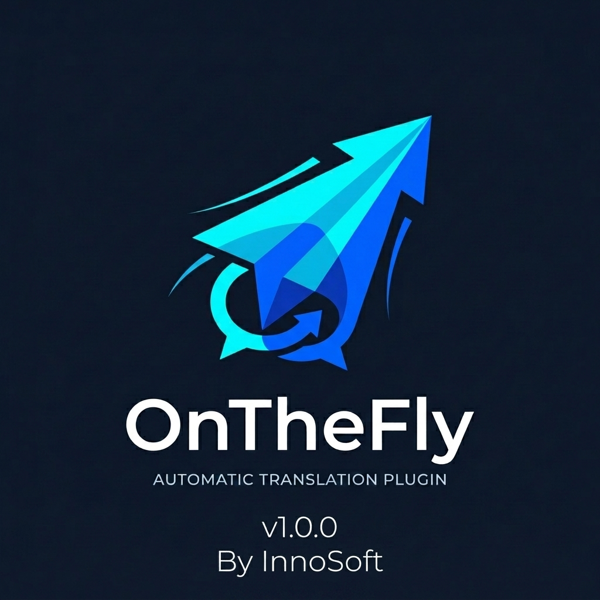

# OnTheFly - Dynamic WordPress Translation Plugin


**OnTheFly** is a professional, high-performance, server-side content translation plugin for WordPress. It acts autonomously by instantly intercepting queries and translating the HTML payload before rendering, utilizing leading cloud providers (Google Translate & DeepL) via a clean, structure-preserving DOM Parser.

## 🚀 Features

- **DOM Parsing without Structural Loss:** Utilizes `DOMDocument` and `DOMXPath` to isolate and strictly intercept text nodes (`DOMText`). It entirely avoids `script` and `style` blocks while keeping essential attributes (`href`, classes) unharmed.
- **Multiple Translation Providers:** Instantly toggle between **Google Cloud Translation API** and **DeepL API** securely from the admin dashboard.
- **Batched API Processing:** Automatically chunks enormous string payloads into robust 50-limit blocks to completely eliminate `HTTP 413 Payload Too Large` restrictions.
- **Intelligent Transient Caching:** MD5-hashed query storing mechanism to save your API costs and deliver responses instantly (On the fly) on repeated requests.
- **100% SEO Optimized:** Dynamically modifies the global WordPress `<html lang="xx">` tags and `<title>` headers based on your translation route to ensure seamless indexability across search engines.
- **Zero-Bloat Architecture:** Compliant with custom strict styling (2-space indent, minimal closures) and a PSR-4 namespace (`OnTheFly\Core`) decoupled autoloader. 

## 🛠️ Installation

1. Download the latest version of the plugin as a `.zip` file from the repository.
2. Log into your WordPress admin panel.
3. Browse to `Plugins` -> `Add New` -> `Upload Plugin`.
4. Select the `.zip` file and click **Install Now**.
5. Once imported, click **Activate Plugin**.

## ⚙️ Configuration

Head over to **Settings -> OnTheFly Settings** in your WordPress dashboard.

1. **Select Active Provider:** Choose between `Google Translate` or `DeepL`.
2. **Setup API Key:** Enter your associated API Key for the active provider.
3. **Configure Targets:** Type your required languages separated by a comma (e.g., `es,fr,de,ar`).
4. **Cache Control:** Flush your active translation caches anytime utilizing the secure Admin nonce-cleared toggle.

## 🚦 Usage

OnTheFly integrates natively via WordPress core endpoints. Standard implementation applies URL parameters directly natively across your post permalinks:

```
https://your-website.com/hello-world/?lang=en
```

Passing the `?lang=xx` query parameter will sequentially trigger dynamic intercepts translating `the_content` and `the_title` to the targeted syntax instantly!

## 📜 Code Standards

- **Strict OOP / Namespaces:** Built around isolated controllers (`TranslationEngine`, `Router`, `Settings`, `Cache`).
- **Clean Code Guarantee:** Zero floating comments internally, following the InnoSoft Strict Standard execution.

---
**Maintained by InnoSoft**
