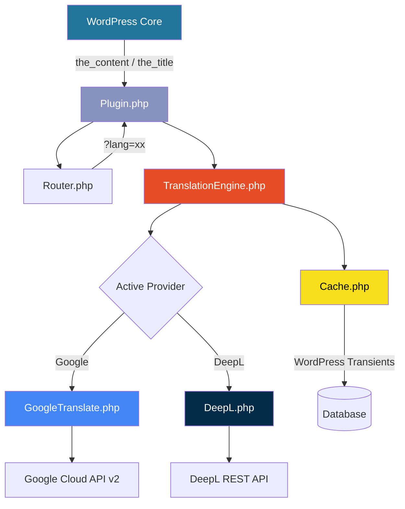
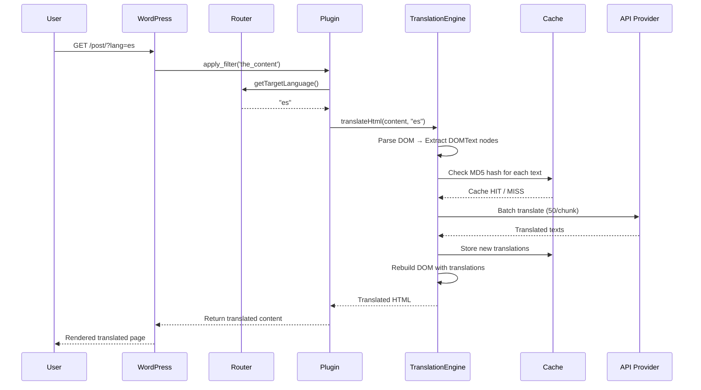

<p align="center">
  
</p>

<h1 align="center">OnTheFly</h1>

<p align="center">
  <strong>Dynamic Server-Side WordPress Translation Plugin</strong>
</p>

<p align="center">
  <a href="#-features">Features</a> •
  <a href="#-architecture">Architecture</a> •
  <a href="#-installation">Installation</a> •
  <a href="#%EF%B8%8F-configuration">Configuration</a> •
  <a href="#-usage">Usage</a> •
  <a href="#-how-it-works">How It Works</a> •
  <a href="#-development">Development</a> •
  <a href="#-contributing">Contributing</a> •
  <a href="#-license">License</a>
</p>

<p align="center">
  
  
  
  
</p>

---

## 📖 Overview

**OnTheFly** is a professional, high-performance, server-side content translation plugin for WordPress. It acts autonomously by instantly intercepting WordPress filters and translating the HTML payload before rendering, utilizing leading cloud translation providers (**Google Cloud Translation API** & **DeepL API**) via a clean, structure-preserving DOM Parser.

Unlike client-side translation solutions, OnTheFly operates entirely on the server — delivering translated pages that are fully SEO-indexable, blazing fast for the end user, and completely invisible in operation.

---

## ✨ Features

| Feature | Description |
|---|---|
| **🔍 DOM Parsing** | Uses `DOMDocument` + `DOMXPath` to isolate and translate only `DOMText` nodes — `<script>`, `<style>`, and all HTML attributes remain completely untouched. |
| **🔄 Multi-Provider Support** | Switch between **Google Cloud Translation API** and **DeepL API** instantly from the admin dashboard. |
| **📦 Batched API Processing** | Automatically chunks large payloads into 50-item batches to eliminate `HTTP 413 Payload Too Large` errors. |
| **⚡ Transient Caching** | MD5-hashed caching via WordPress Transients API — dramatically reduces API costs and delivers instant responses on repeated requests. |
| **🌐 SEO Optimized** | Dynamically updates `<html lang="xx">` and `<title>` tags based on the active translation route for full search engine indexability. |
| **🛡️ Secure** | API keys stored via WordPress Settings API; cache clearing protected by WordPress nonce verification. |
| **🧩 Modular Architecture** | PSR-4 namespaced (`OnTheFly\Core`), OOP design with a provider interface for easy extension. |

---

## 🏗️ Architecture

```
OnTheFly/
├── onthefly.php                          # Plugin entry point & PSR-4 autoloader
├── composer.json                         # Dependency management & scripts
├── phpcs.xml                             # PHP CodeSniffer configuration (PSR-12)
├── phpstan.neon                          # PHPStan static analysis (Level 4)
├── logo.png                              # Plugin branding
│
├── src/
│   ├── Plugin.php                        # Main controller — hooks & filters
│   ├── TranslationEngine.php             # DOM parser & batch translation logic
│   ├── Router.php                        # Language route interception (?lang=xx)
│   ├── Cache.php                         # WordPress Transients caching wrapper
│   │
│   ├── Providers/
│   │   ├── TranslationProviderInterface.php  # Provider contract
│   │   ├── GoogleTranslate.php               # Google Cloud Translation v2
│   │   └── DeepL.php                         # DeepL API (Free & Pro)
│   │
│   └── Admin/
│       └── Settings.php                  # Admin UI for plugin configuration
│
└── .github/
    ├── dependabot.yml                    # Automated dependency updates
    └── workflows/
        └── ci.yml                        # CI pipeline (lint, PHPCS, PHPStan)
```

### Component Diagram



---

## 📥 Installation

### Method 1: Upload via WordPress Admin

1. Download the latest `onthefly.zip` from [Releases](../../releases).
2. Log into your WordPress admin panel.
3. Navigate to **Plugins → Add New → Upload Plugin**.
4. Select the `.zip` file and click **Install Now**.
5. Click **Activate Plugin**.

### Method 2: Manual Installation

1. Clone or download the repository:
   ```bash
   git clone https://github.com/InnoSoft-Company/OnTheFly.git
   ```
2. Copy the `OnTheFly` folder into your WordPress plugins directory:
   ```bash
   cp -r OnTheFly /path/to/wordpress/wp-content/plugins/
   ```
3. Activate from **Plugins** in your WordPress admin.

### Method 3: Composer (for developer setups)

```bash
cd /path/to/wordpress/wp-content/plugins/OnTheFly
composer install
```

---

## ⚙️ Configuration

After activating the plugin, navigate to **Settings → OnTheFly** in your WordPress dashboard.

### Settings Panel

| Setting | Description | Example |
|---|---|---|
| **Active Translation Provider** | Select between Google Translate or DeepL | `Google Translate` |
| **Google Translate API Key** | Your Google Cloud Translation API key | `AIzaSy...` |
| **DeepL API Key** | Your DeepL API authentication key | `xxxxxxxx-xxxx:fx` |
| **Target Languages** | Comma-separated ISO 639-1 language codes | `es,fr,de,ar,ja` |

### Cache Management

The settings page includes a **Clear Translation Cache** button that securely purges all cached translations from the database using WordPress nonce verification. This is useful when:

- You update your website content and need fresh translations
- You switch translation providers
- You want to force re-translation of all content

> **Note:** The cache uses a 30-day expiration by default. Cached entries are stored as WordPress transients with the `onthefly_` prefix.

---

## 🚀 Usage

OnTheFly integrates natively with WordPress URL structure. Simply append the `?lang=` query parameter to any page or post URL:

```
https://your-website.com/hello-world/?lang=es     → Spanish
https://your-website.com/about-us/?lang=fr         → French
https://your-website.com/contact/?lang=de          → German
https://your-website.com/blog/my-post/?lang=ar     → Arabic
https://your-website.com/page/?lang=ja             → Japanese
https://your-website.com/page/?lang=pt-BR          → Brazilian Portuguese
```

### What Gets Translated

| Content | Translated | Hook |
|---|---|---|
| Post/Page body content | ✅ | `the_content` |
| Post/Page title (in-page) | ✅ | `the_title` |
| Document `<title>` tag | ✅ | `document_title_parts` |
| `<html lang="">` attribute | ✅ | `language_attributes` |
| Scripts & Styles | ❌ (intentionally skipped) | — |
| HTML attributes (href, class, etc.) | ❌ (preserved as-is) | — |

### Language Code Format

The plugin accepts valid **ISO 639-1** language codes:
- Two-letter codes: `en`, `es`, `fr`, `de`, `ar`, `ja`, `ko`, `zh`
- Region-specific codes: `pt-BR`, `zh-TW`, `en-US`

Invalid codes are silently ignored, and the page renders in its original language.

---

## 🔬 How It Works

### Translation Pipeline



### Key Technical Details

1. **DOM Parsing**: The `TranslationEngine` uses PHP's `DOMDocument` and `DOMXPath` to safely traverse HTML. Only `DOMText` nodes are extracted — all structural elements, attributes, scripts, and styles remain untouched.

2. **Batch Processing**: Text nodes are grouped and sent to the API in chunks of 50 to respect API payload limits. This prevents `HTTP 413` errors on content-heavy pages.

3. **Cache-First Strategy**: Before making any API call, each text segment is checked against the cache using an MD5 hash of `text_targetLanguage`. Only uncached segments are sent to the API, minimizing costs.

4. **Provider Abstraction**: The `TranslationProviderInterface` defines a single `translate(array $texts, string $targetLanguage): array` contract. Adding a new provider (e.g., Microsoft Translator, Amazon Translate) requires implementing just this one method.

5. **DeepL Smart Endpoint**: The DeepL provider automatically detects whether to use the Free API (`api-free.deepl.com`) or Pro API (`api.deepl.com`) based on the API key format (`:fx` suffix indicates free tier).

---

## 🛠️ Development

### Prerequisites

- PHP >= 7.4
- [Composer](https://getcomposer.org/)

### Setup

```bash
git clone https://github.com/InnoSoft-Company/OnTheFly.git
cd OnTheFly
composer install
```

### Available Scripts

| Command | Description |
|---|---|
| `composer lint` | Run PHP CodeSniffer (PSR-12 standards check) |
| `composer lint-fix` | Auto-fix coding standards violations |
| `composer analyze` | Run PHPStan static analysis (Level 4) |

### Code Standards

- **Style**: PSR-12 with 2-space indentation
- **Namespace**: `OnTheFly\Core`
- **Static Analysis**: PHPStan Level 4 with WordPress stubs
- **Clean Code**: Minimal comments policy in `src/` files

### CI/CD Pipeline

The project includes a GitHub Actions workflow (`.github/workflows/ci.yml`) that runs on every push and pull request to `main`/`master`:

| Stage | Tool | Description |
|---|---|---|
| **Syntax Check** | `php -l` | Validates PHP syntax across all files |
| **Dependency Audit** | `composer audit` | Checks for known security vulnerabilities |
| **Code Style** | PHP CodeSniffer | Enforces PSR-12 coding standards |
| **Static Analysis** | PHPStan | Type-checking and bug detection at Level 4 |

### Dependency Management

- **Dependabot** is configured to automatically create weekly pull requests for:
  - Composer package updates
  - GitHub Actions version updates

---

## 🧩 Extending: Adding a New Provider

To add a new translation provider, implement the `TranslationProviderInterface`:

```php
<?php

namespace OnTheFly\Core\Providers;

class AmazonTranslate implements TranslationProviderInterface
{
  public function translate(array $texts, string $targetLanguage): array
  {
    // Your implementation here
    // $texts = ['Hello', 'World'];
    // Return: ['Hola', 'Mundo'];
  }
}
```

Then register it in `Plugin.php` and add the corresponding option to `Admin/Settings.php`.

---

## 📋 Requirements

| Requirement | Minimum Version |
|---|---|
| PHP | 7.4+ |
| WordPress | 5.0+ |
| Google Cloud Translation API | v2 |
| DeepL API | v2 (Free or Pro) |

---

## ❓ FAQ

<details>
<summary><strong>Does OnTheFly work with page builders like Elementor or WPBakery?</strong></summary>

Yes. OnTheFly hooks into `the_content` and `the_title` WordPress filters which fire after page builders render their output. All text nodes within the final HTML will be translated.
</details>

<details>
<summary><strong>Will it translate my theme's navigation menus or widgets?</strong></summary>

Currently, OnTheFly translates content passed through `the_content` and `the_title` filters. Theme elements outside these hooks (menus, widgets, footers) are not translated in this version.
</details>

<details>
<summary><strong>How much does using the translation APIs cost?</strong></summary>

- **Google Cloud Translation**: Free tier covers 500,000 characters/month. Beyond that, $20 per 1M characters.
- **DeepL**: Free tier covers 500,000 characters/month. Pro plans start at €5.49/month + usage.

OnTheFly's caching system significantly reduces API calls by caching translations for 30 days.
</details>

<details>
<summary><strong>Can I use this plugin on a multilingual site with WPML or Polylang?</strong></summary>

OnTheFly is designed as a standalone translation solution. While it can coexist with other plugins, using it alongside WPML or Polylang may cause conflicts with the `?lang=` parameter. It's recommended to use one solution at a time.
</details>

<details>
<summary><strong>Is the plugin safe for production use?</strong></summary>

Yes. API keys are stored securely via the WordPress Settings API. Cache operations are protected by nonce verification. All user inputs are sanitized. The plugin gracefully falls back to original content if API calls fail.
</details>

---

## 🤝 Contributing

Contributions are welcome! Please follow these steps:

1. **Fork** the repository
2. **Create** a feature branch: `git checkout -b feature/amazing-feature`
3. **Follow** the coding standards (PSR-12, 2-space indentation)
4. **Test** your changes: `composer lint && composer analyze`
5. **Commit** with clear messages: `git commit -m 'Add amazing feature'`
6. **Push** to your branch: `git push origin feature/amazing-feature`
7. **Open** a Pull Request

### Development Checklist

- [ ] Code follows PSR-12 standards with 2-space indentation
- [ ] PHPStan analysis passes at Level 4
- [ ] No comments in `src/` files (InnoSoft standard)
- [ ] New providers implement `TranslationProviderInterface`
- [ ] Settings are registered via `Admin\Settings`

---

## 📜 License

This project is licensed under the **GPL-2.0-or-later** license — see the [LICENSE](LICENSE) file for details.

---

## 👨‍💻 Author

**InnoSoft** — Mohamed Ahmed Ghanam (CEO)

---

<p align="center">
  <sub>Built with ❤️ by <strong>InnoSoft</strong> — Translating the web, one page at a time.</sub>
</p>
